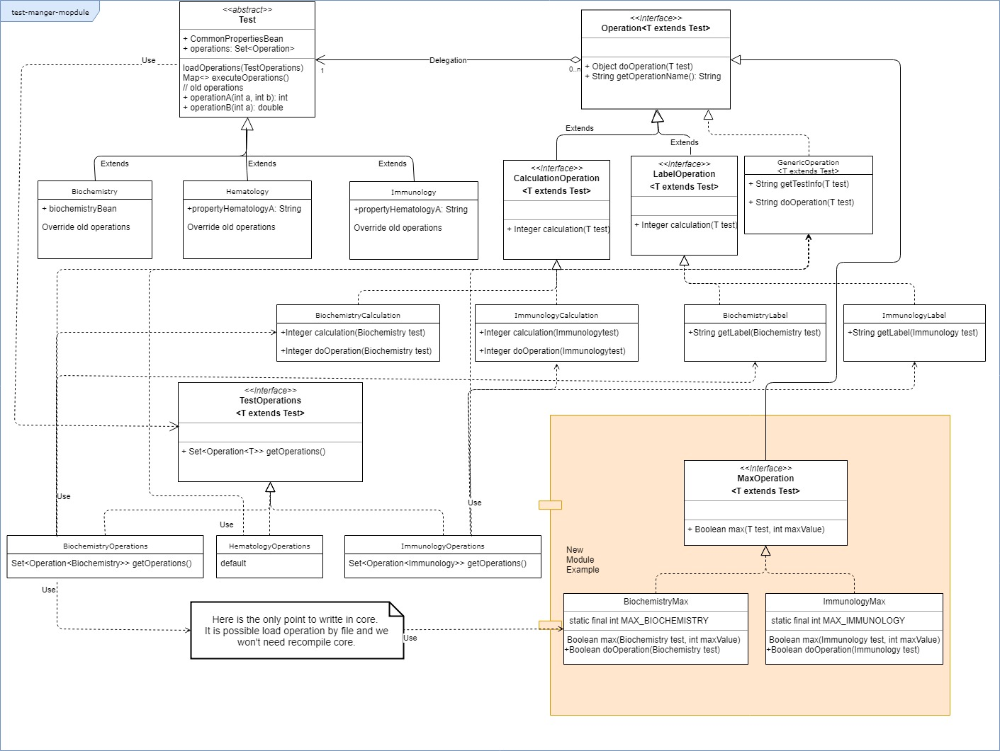

# Test manager module

Refactoring strategy for Test Manager Module of LIS (Laboratory Information System).

## Patterns used

The proposal solution is based in SOLID principles and core features of OOP Encapsulation, Inheritance, Polymorphism and Abstraction.
In addition to that I have used delegate pattern for the relation between operations and test types.

- Single responsibility principle: All the objects have one responsibility for instance BiochemistryCalculation object has the responsibility of do all the operations related with Biochemistry Calculation.

- Open/Closed principle: This design is open for extension, for that reason I use Test abstract class, Operation interface, all the operations that are candidates for having different implementations by type are interfaces as well. Even TestOperations is an interface for load the different types of test in a different way implementing it.
This design allows create new operations and more test types without modifying anything for that reason is closed for modification.

- Liskov substitution principle: All the interfaces and abstract class test works perfect without dependencies with its subtypes objects. If any operation it's removed or changed the software won't be affected.

- Interface segregation principle: It is achieved by Operations interfaces for example CalculationOperation and LabelOperation each operation has its own interface. With this approach we achieve that only the test types that need an implementation they implement it.

- Dependency inversion principle: All the code is based in interfaces and generics for not depending on an implementation.

Below image we can see an example of how execute all the test operations without knowing its implementation.

```java
	public Map<String, Object> executeOperations() {
		Map<String, Object> resultMap = new HashMap<>();
		operations.parallelStream().forEach(o -> {
			resultMap.put(o.getOperationName(), o.doOperation(this));
		});

		return resultMap;
	}
```


## UML diagram



## Refactoring strategy

### Before refactoring

- Design the solution first.
- Make a proof of concept of the proposal solution first.
- Make a list of operations:  Divide it by complexity, coupling and importance. Migrating easy and less importance operations first.
- Check common code:  Eliminate code duplications and make as simple as possible before refactoring.
- Check unit test: If they are not enough make the necessary test before refactoring.
- Check all the libraries: it is a good moment for version update.
- Divide refactoring in phases.
	* Phase 1: Move Test hierarchy using inheritance for all the types with the common properties in Test parent and the own types properties in the type class.
	* Phase 2: Move old operations to Test parent and override the necessary in its sons (the different types).
	* Phase 3: Creates the delegate patron for operations and make it with generics.
	* Phase 4: Move all the operations to delegate patron.
- Create task for these phases.
- Design and document the refactor strategy.

### During refactoring

- Make unit test: Create unit test as soon as possible.
- Start by simple and loose coupling operations.
- Try to refactor as little piece of code as possible and test it.
- Document all the possible changes, the things that are not possible to refactor now...
- Update the technical documentation.

### After refactoring

- Execute the entire test (unit, integration, security...)
- Check if all the functionalities are working as before and none of them have been lost.
- Make sure that developers have knowledge about the new architecture. Possible training may be required.
- Verify the new code with pull request for avoid as far as possible new refactor.

## Notes of the proposal solution

- Only there is one test for test the structure. For test operations are necessary do a unit test by each implementation it is simple with this approach. I don't do here because operations are invented and I think it is not relevant for this exercise.

- There are examples of common Operations (interface TestOperations default method), different implementations for type, operations for only two test types and in the junit test OperationTest addHematologyOperation there are an example of add operation dynamically (I don`t like personally this approach because its difficult to maintain if it is not done with care):

```java
	// It is possible add operation dynamically
	hematology.addOperation(new LabelOperation<Hematology>() {
		@Override
		public String getLabel(Hematology test) {
			return test.getPropertyHematologyA() + ": " + test.getCommonProperties().getCommonPropertyA();
		}
	});
```
	
- The responses map with class name String key it's a quick idea for executing and test it quick. I have imagined that operations no need a response, they save theirs results in a data base, file, send to other systems, etc. But if response was required and was more complex I would make a hierarchy of generics responses objects by test type.
